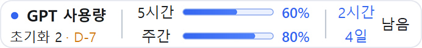
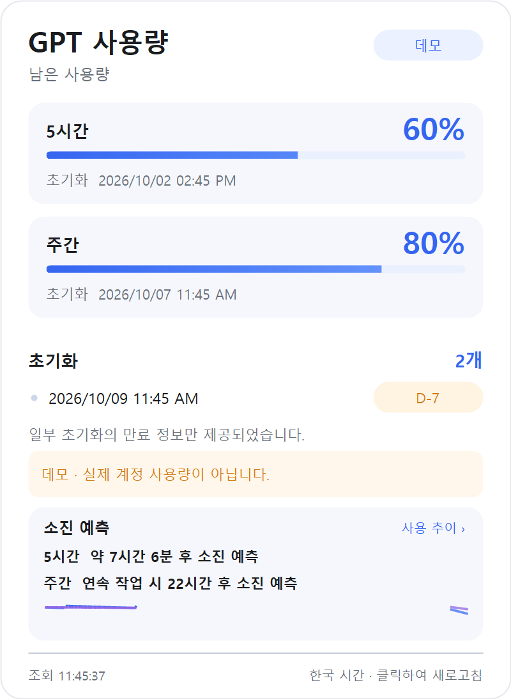
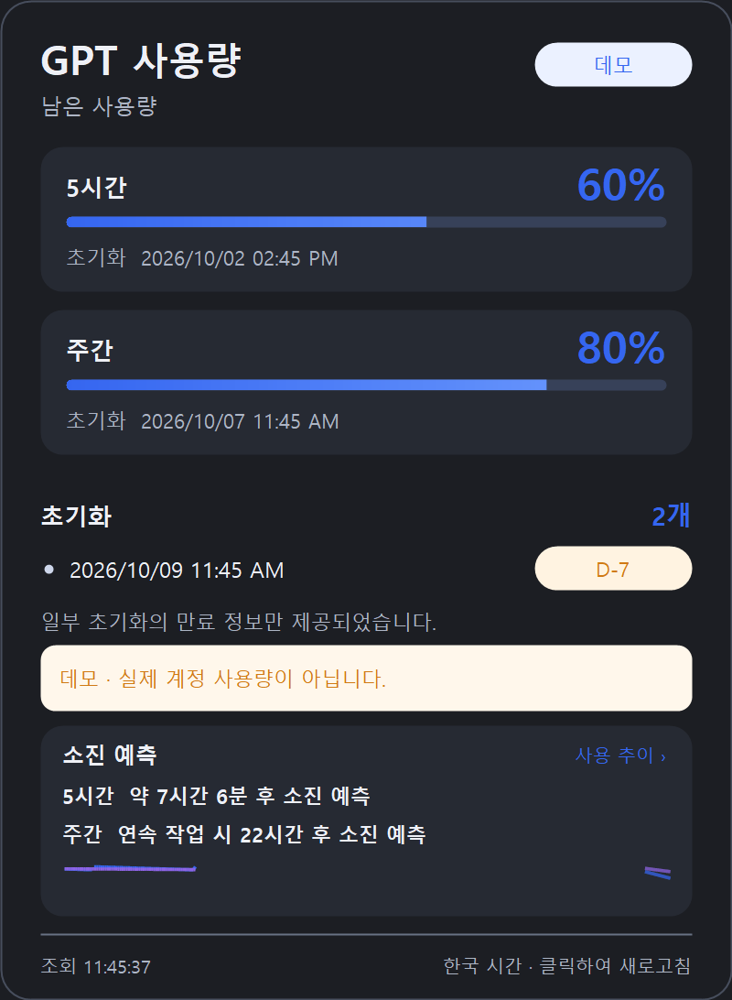
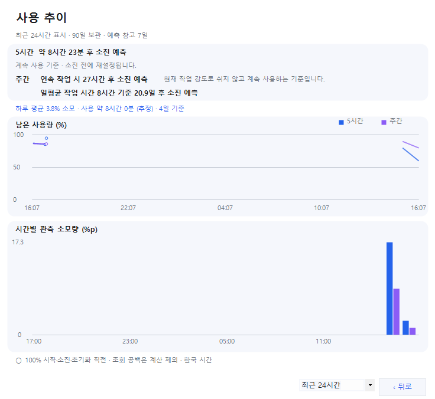
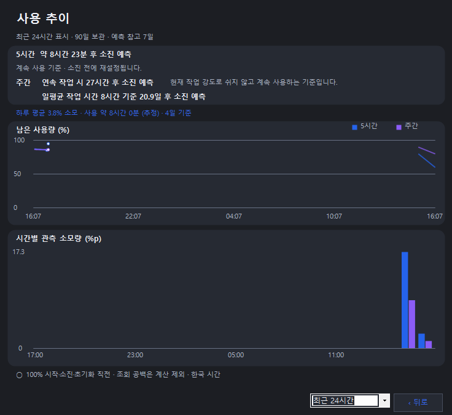
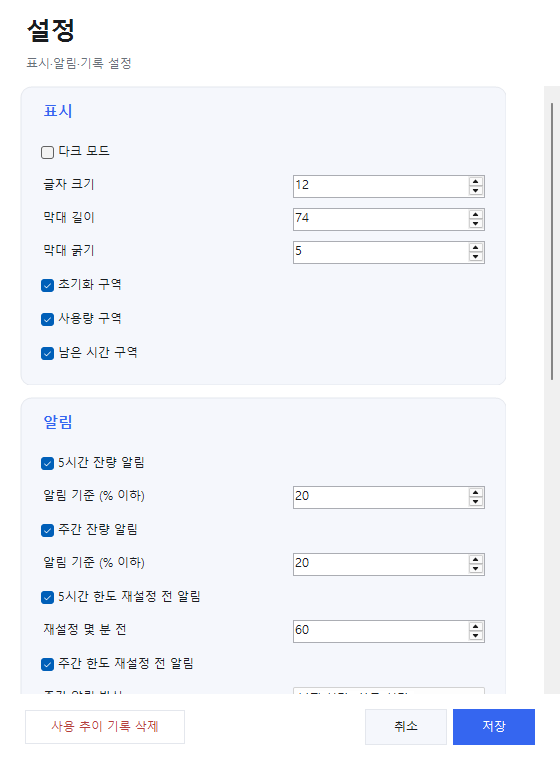

# GPT Usage Widget

영어 안내는 [영어 README](README.md)를 확인하세요.

Windows 작업표시줄의 시계 왼쪽에 현재 Codex 계정의 남은 5시간·주간 한도를 표시하는 비공식 로컬 위젯입니다. 화이트·다크 테마를 지원하며 강조색은 파란색 `#3566F0`입니다.

제품명은 **GPT Usage Widget**입니다. 기존 사용자 기록을 유지하기 위해 저장 폴더 `%LOCALAPPDATA%\GPTUsageTaskbar`와 내부 식별자는 변경하지 않습니다.


## 화면 미리보기

아래 이미지는 실제 계정 정보가 아닌 가상 데이터로 생성했습니다. 한국어·영어판 모두 화이트·다크 테마를 지원합니다.

| 화면 | 화이트 테마 | 다크 테마 |
| --- | --- | --- |
| 작업표시줄 위젯 |  |  |
| 사용량 상세 패널 |  |  |
| 사용 추이 |  |  |

설정 창:



**처음 사용하는 분:** [다운로드(Releases)](https://github.com/eespark/gpt-usage-widget/releases)에서 Windows x64 ZIP을 받아 압축을 해제한 뒤 실행합니다. [사용 가이드](사용%20가이드.md)를 참고하세요. 실행 파일이 아직 게시되지 않았거나 소스 코드만 받았다면 아래 빌드 절차를 먼저 진행합니다.

영어판은 `GPTUsageWidget-v1.0.1-win-x64-en.zip`으로 별도 배포합니다. 영어 사용 안내는 [영어 README](README.md)로 통합했으며 영어 ZIP에도 같은 문서를 포함합니다. 한국어판의 위젯·상세 패널 제목은 `GPT 사용량`, 영어판은 `GPT Usage`입니다. 영어판도 한국 시간(KST, UTC+9)을 사용하며 두 언어판은 같은 로컬 설정·기록을 공유하므로 하나만 실행합니다.

## 언어별 빌드와 배포

`package.ps1`을 실행하면 같은 소스로 한국어판과 영어판을 각각 빌드·검증하고 두 ZIP과 SHA-256 파일을 생성합니다. 영어판만 빌드하려면 `build.ps1 -English`를 실행합니다. 영어 실행 파일 이름은 `GPTUsageWidget.en.exe`이며 외부 번역 파일 없이 실행할 수 있습니다. 번역 원본은 `assets/translations.en.json`이고 빌드 시 누락된 번역을 검사합니다. GitHub Actions도 두 언어판을 함께 검증·보관합니다.

## 실행과 로그인

`bin/GPTUsageWidget.exe`를 실행합니다. Windows x64와 .NET Framework 4.8 환경을 사용하며, 별도 .NET SDK나 관리자 권한은 필요하지 않습니다.

- Codex 앱 또는 CLI가 설치되어 있고, 조회에 사용하는 CLI가 ChatGPT 계정으로 로그인되어 있어야 합니다.
- 데스크톱 앱 내부 CLI와 기존 로그인 상태가 검색되면 위젯을 따로 로그인할 필요가 없습니다. 브라우저에서 ChatGPT에 로그인한 것만으로 CLI 로그인까지 완료되는 것은 아닙니다.
- 설치 경로가 자동 검색되지 않으면 `CODEX_USAGE_CLI` 환경 변수에 `codex.exe`의 절대 경로를 지정합니다. CLI는 이 설정, PATH, 로컬 Codex 앱 설치 경로 순서로 검색합니다.
- 자체 로그인 창이나 자동 CLI 설치 기능은 아직 없습니다. API 키만으로 로그인한 환경에서는 구독 한도가 제공되지 않을 수 있습니다.
- 인증과 인증 갱신은 Codex CLI가 담당합니다. 위젯은 비밀번호·인증 파일·토큰을 직접 읽거나 저장하지 않습니다.

이 위젯의 대상은 **Codex 한도**입니다. ChatGPT 일반 채팅의 모든 모델별 메시지 한도를 통합해서 보여주는 도구는 아닙니다.

## 표시와 조작

- 기본 위치는 기본 모니터 작업표시줄 내부, 시계·알림 영역 왼쪽입니다.
- 초기화 구역에는 초기화 개수와 가장 가까운 만료일까지 남은 일수를 표시합니다. D-7부터 만료 표시를 주황색으로 강조합니다. D-day는 항상 아래 줄에 둡니다.
- 사용량 구역은 위에 5시간, 아래에 주간 한도입니다. 막대와 퍼센트는 **남은 비율**이며, 사용량이 40%이면 60%를 표시합니다. 기본 막대 길이 74픽셀, 굵기 5픽셀입니다. 구역 양쪽 여백은 10픽셀입니다.
- 남은 시간 구역은 5시간 한도에 `n시간` 또는 `n분`, 주간 한도에 `n일`, `n시간` 또는 `n분`을 표시합니다. 일·시간은 내림하고 분은 올림합니다. 남은 시간이 1분 미만이어도 `1분`으로 표시합니다. 주간에서 1일은 24시간을 기준으로 합니다.
- 공통 `남음`은 오른쪽의 두 줄 사이에 한 번만 표시합니다. 시간·일수는 같은 폭의 영역 안에서 가운데 정렬하고, 긴 쪽 문구 끝에서 4픽셀 떨어지게 배치합니다. 문구 끝에 맞춰 카드 폭을 조정합니다.
- 재설정 시각이 지났으면 서버의 새 응답을 확인할 때까지 `대기`로 표시합니다. 임의로 잔량을 100%로 바꾸지 않습니다. 정보가 제공되지 않으면 `—`로 표시합니다.
- 마우스를 약 0.4초 올리면 위젯 위에 카드형 상세 패널이 나타납니다. 소진 예측 카드 또는 카드 오른쪽의 사용 추이를 클릭하면 같은 상세 패널 안에서 사용 추이 화면으로 전환합니다. 오른쪽 아래의 뒤로 버튼으로 돌아오고 패널 바깥을 클릭하면 닫힙니다. 기간 선택 목록은 패널 내부 조작으로 취급합니다. 선택해서 연 추이 화면은 마우스를 밖으로 옮겨도 유지됩니다. 전체 재설정 날짜·시간과 AM/PM, 초기화별 만료 시각, 최근 사용 추이와 소진 예상을 볼 수 있습니다. 모든 재설정·알림 일정은 한국 시간을 기준으로 합니다.
- 왼쪽 클릭 후 버튼 놓기는 즉시 조회입니다. 상세 패널에서도 클릭하여 조회할 수 있습니다. 평소에는 파란 원, 조회 중에는 회전하는 화살표를 표시합니다.
- 왼쪽 드래그는 위치 이동이며 조회를 실행하지 않습니다.
- 우클릭 메뉴에서 위치, 표시·알림·기록 설정, 사용 추이, 자동 실행, 종료를 선택합니다. 자동 실행은 기본 꺼짐입니다.
- 위젯이 보이지 않으면 트레이 아이콘을 우클릭하고 **위젯 다시 표시**을 선택합니다. 위젯 창을 껐다 다시 만들며 현재 사용량·기록·설정을 유지합니다. 사용량을 조회하는 **지금 새로고침**과 별도 기능입니다. 전체 화면 앱이나 숨겨진 작업표시줄에서는 기존 규칙에 따라 숨깁니다.
- 글자는 화면 배율에 맞춘 네이티브 ClearType으로, 도형은 3배 해상도에서 그려 축소합니다.

## 알림

잔량·재설정 전 알림을 기본으로 켰습니다. 우클릭 → **표시·알림·기록 설정**에서 각각 끄거나 기준을 변경할 수 있습니다. 긴 설정 목록은 스크롤하며 저장·취소 버튼은 하단에 고정합니다.

1. 5시간·주간의 잔량 기준을 **각각 1~100% 이하**로 선택합니다. 기본값은 둘 다 20%이며 각각 켜고 끌 수 있습니다.
2. 5시간 한도의 재설정 알림을 **1~300분 전**으로 선택합니다. 기본은 60분 전입니다.
3. 주간 재설정은 **0~7일 전의 지정 시각(한국 시간)** 또는 **1~10,080분 전** 중 선택합니다. 기본은 전날 오후 12시 30분입니다. 초기화권의 만료 알림과는 별개입니다.

동일한 한도 주기에서 같은 기준의 알림은 한 번만 발생하도록 사용자 폴더에 이력을 저장합니다. 재실행해도 같은 알림을 반복하지 않습니다. 기준을 바꾸면 새 기준에 대한 알림이 한 번 발생할 수 있습니다. 알림을 켠 시점이나 프로그램을 실행한 시점에 이미 조건이 충족되었다면 유효한 조건에 대해 한 번 안내합니다. 날짜·시각 방식의 주간 알림을 놓치고 예약 날짜 안에 복귀하면 그날에 한해 안내합니다.

프로그램이 실행되지 않거나 PC가 꺼져 있을 때 알림을 예약 실행하지는 않습니다. 절전 중에도 정각 알림을 표시할 수 없습니다. Windows의 알림 차단·집중 모드·조직 정책에 따라 표시가 제한될 수 있습니다. 오래된 조회 값으로는 알림을 띄우지 않습니다.

## 효율적인 조회

기본 설정에서 전원 연결 시 60초, 배터리 사용 시 120초마다 조회합니다. 오프라인·절전·화면 잠금 중에는 자동 조회를 멈추고, 연결 복구·절전 해제·잠금 해제 후 바로 다시 조회합니다. 한도 재설정 시각이 지나면 즉시 한 번 조회합니다.

조회 실패가 이어지면 재시도 간격을 2분, 4분, 8분, 최대 15분까지 늘립니다. 조회에 성공하면 정상 간격으로 돌아갑니다. 클릭 조회는 대기 간격과 무관하게 실행할 수 있습니다. 인터넷이 없거나 절전 중이면 실행하지 않습니다. 화면은 내용이 바뀔 때 다시 그려 불필요한 반복 렌더링을 줄입니다.

설정에서 효율적인 조회를 끄면 자동 조회는 60초 간격으로 유지하고 배터리·잠금 상태에 따른 조절과 실패 간격 증가는 적용하지 않습니다. 오프라인·절전 중 조회는 계속 제한됩니다.

조회는 공식 앱 서버의 `initialize`, `initialized`, `account/rateLimits/read`만 호출합니다. 모델에게 질문하지 않으므로 토큰 기반 추론 API 비용이 발생하지 않습니다. 초기화권을 소비하는 요청도 없습니다.

## 표시 설정

우클릭 → **표시·알림·기록 설정**에서 다음 항목을 바꿀 수 있습니다.

- 설정 맨 위의 `다크 모드` 체크를 켜거나 끄고 저장하여 테마를 전환합니다. 위젯, 상세 패널, 사용 추이 화면에 적용합니다.
- 글자 크기 11~14픽셀, 막대 길이 50~110픽셀, 굵기 3~7픽셀.
- 초기화·사용량·남은 시간 구역의 표시 여부. 최소 한 구역은 표시해야 합니다.
- 알림 3종, 효율적인 조회, 사용 추이 기록의 켜기·끄기.
- 기록 보관 기간 30·90·180·365일(기본 90일), 예측 참고 기간 1·3·7·14일(기본 7일).
- 저장된 사용 추이 기록 삭제. 보관 기간을 줄이면 선택 기간보다 오래된 기록을 삭제하므로 확인 창을 표시합니다.

위젯 높이는 기본 작업표시줄 안에 들어가도록 40픽셀로 유지합니다. 구역 표시와 글자·막대 크기에 맞춰 가로 폭은 자동으로 조정합니다.

## 사용 추이와 예측

우클릭 → **사용 추이**에서 잔량 그래프와 관측 소모량을 확인합니다. 오른쪽 아래에서 최근 24시간·7일·30일·90일·180일·365일 중 보관 기간 이내의 기간을 선택합니다. 24시간 화면은 시간별 소모량을, 긴 기간은 선택 기간을 24구간으로 나눈 소모량을 표시합니다. 단위 `%p`는 잔량 퍼센트의 감소 폭입니다. 예를 들어 70%에서 60%로 줄면 10%p입니다. 추이 화면도 열려 있는 동안 60초마다 새 자료를 반영합니다.

기본으로 최근 90일의 조회 시각, 5시간·주간 잔량, 각 한도의 재설정 시각만 PC에 저장합니다. 재실행 후 다시 불러옵니다. 최근 14일은 조회 단위로, 더 오래된 자료는 5분 단위 마지막 값으로 보관하며 재설정 경계는 유지합니다. 인증 정보, 대화 내용, 이메일, 초기화권 상세는 기록하지 않습니다. 별도 수집 서버로 전송하지 않습니다. 설정에서 기록을 끄면 새 자료를 저장하지 않으며, 기존 자료는 삭제 버튼으로 지울 수 있습니다. 이전 버전이 이미 삭제한 기록은 복원되지 않습니다.

상세 패널은 5시간·주간의 핵심 예측만 표시합니다. 일평균 기준 일수와 계산 설명은 사용 추이에서 확인합니다. 사용 추이에서 5시간은 `약 3시간 54분 후 소진 예측`처럼 표시합니다. 5시간·주간의 연속 예측은 현재 잔량을 양의 소비 구간에서 평활한 시간당 작업 강도로 나눕니다. 현재 강도로 쉬지 않고 계속 사용하는 조건이며 일평균 통계를 쓰지 않습니다. 주간은 `연속 작업 시 16시간 후 소진 예측`과 바로 아래의 `일평균 작업 시간 2시간 기준 8일 후 소진 예측`을 함께 표시합니다. 일수는 잔량을 일평균 소모량으로 나눈 독립적 예측입니다. 문구의 일평균 작업 시간은 참고 통계이며 연속 시간을 이 값으로 나누지 않습니다. 필요한 기록이 부족하면 해당 예측만 보류합니다. 주간 두 예측은 5시간과 같은 크기·볼드로 두 줄에 표시합니다. 일평균 문구는 연속 작업 문구 바로 아래에 왼쪽을 맞추고, 연속 작업 설명은 첫 줄 우측의 회색 글씨로 표시합니다. 주간 하루 평균에는 소모량과 소모가 관측된 15분 구간 기준 평균 사용 시간(추정)을 함께 표시합니다. 재설정이 먼저 오는 경우도 알립니다. TSB는 사용 강도와 사용 확률을 따로 갱신하며, 기록이 충분하면 과거 시점의 1시간·5시간 예측 오차로 후보를 선택합니다.

완료된 15분 구간을 사용하며 재설정·잔량 증가·10분 초과 공백·관측률 90% 미만 구간을 제외합니다. 사용 시간분은 최소 4구간·양의 소비 3구간, 5시간 패턴은 최소 16구간이 필요합니다. 주간은 하루 4시간 이상 관측한 완료 날짜 3개부터 소비와 시간대 분포를 사용하며 시간당 속도를 24배하지 않습니다. 절전·재부팅의 누락은 무사용으로 학습하지 않고 기존 기록을 참고합니다. `검증 MAE`는 과거 모델 선택 오차이며 미래 오차 보장은 아닙니다. 조회가 오래되거나 기록이 부족하면 보류합니다. 미관측 소비가 빠질 수 있는 조건부 추정이며 작업·토큰 개수나 확정 소진 시각이 아닙니다.

권장값의 비교 자료와 계산 방법은 [분석 기간과 예측](분석%20기간과%20예측.md)에 정리했습니다. 보관 90일과 예측 참고 7일은 이 위젯의 설계 선택이며 공식 Codex 표준이나 정확도가 검증된 최적값은 아닙니다.

설정·알림 이력·사용 추이 파일은 `%LOCALAPPDATA%\GPTUsageTaskbar`에 저장합니다. 이전 버전의 실행 파일 옆 `settings.json`은 새 사용자 설정이 없을 때 읽어 기존 위치를 유지합니다.

## 배포와 보안

Codex 데스크톱 앱을 사용하는 동료 연구자에게 **무료 로컬 시험판**으로 공유하거나 GitHub에 소스를 공개하는 용도로 사용할 수 있습니다. 모든 설치 환경에서 절차 없이 실행되는 독립형 정식 배포판은 아닙니다. CLI 검색, 기존 로그인 공유, 한도 응답이 정상인 PC에서는 위젯 자체의 추가 로그인 없이 실행합니다. 다른 설치 경로나 프로필에서는 경로 지정·로그인 확인이 필요할 수 있습니다.

- 실행 파일은 아직 디지털 서명되지 않아 SmartScreen 경고 또는 조직 정책에 따른 차단이 발생할 수 있습니다. [Microsoft의 배포 안내](https://learn.microsoft.com/en-us/windows/apps/package-and-deploy/smartscreen-reputation)
- 현재 인증 방식의 기존 로컬·오픈 소스 앱 이용은 공식 문서에 안내되어 있습니다. 같은 인증 방식은 상업용·호스팅 서비스에 허용되지 않는다고 명시되어 있으므로 유료 서비스로 바꾸기 전에는 별도 검토가 필요합니다. [OpenAI 공식 앱 서버 문서](https://learn.chatgpt.com/docs/app-server)
- 위젯은 일반 사용자 권한으로 실행합니다. 별도 네트워크 수신 포트 대신 자식 프로세스의 표준 입출력을 사용합니다. 실행할 Codex 파일의 서명·무결성 검증과 여러 PC에서의 호환 검증은 추가 보강 대상입니다. 보안 감사를 완료한 제품은 아닙니다.
- 배포할 때는 실행 파일과 안내 문서를 선별합니다. 개인 사용량이 포함될 수 있는 `probe-result.json`, 화면 진단 파일, 개인 설정, 테스트 실행 파일과 미리보기 파일이 섞인 `bin` 전체를 그대로 공유하지 마세요. 사용자 폴더의 사용 추이·알림 기록도 배포물에 포함하지 않습니다.
- 위젯 소스와 자체 아이콘은 [MIT 라이선스](LICENSE)입니다. 이 프로그램은 OpenAI의 공식 제품이 아니며, Codex 및 서비스 이용에는 해당 서비스의 약관이 별도로 적용됩니다. 다른 프로젝트의 소스를 복사하지 않고 자체 작성했습니다.

## 화면 동작의 제한

- Explorer에 코드를 주입하지 않고 별도의 테두리 없는 창을 작업표시줄 위에 겹칩니다. 앱 버튼 공간을 자동 예약하지 않으므로 버튼과 겹치면 드래그나 위치 메뉴로 조절합니다.
- 전체 화면 앱과 숨겨진 작업표시줄에서는 위젯을 숨깁니다. 작업표시줄 크기·배율·Explorer 재시작에 맞춰 위치를 다시 계산합니다.
- 기본 모니터의 한 곳에 표시합니다. 모든 모니터 동시 표시는 지원하지 않습니다.
- 세로 또는 매우 작은 작업표시줄에서는 가로 위젯이 영역 밖에 표시될 수 있습니다.
- 조회 실패나 5분 이상 지난 값은 이전 조회 값으로 표시합니다. 누락된 값은 0%나 100%로 추정하지 않습니다.

## 빌드와 검증

아이콘은 파란 바탕과 두 줄의 잔량 막대로 구성한 자체 디자인입니다. 빌드 시 `tools/CreateIcon.cs`가 16~256픽셀 크기의 아이콘을 생성하고 실행 파일에 포함합니다. 실행 파일과 트레이에서 같은 아이콘을 사용합니다. `assets/app.svg`는 벡터 원본이며 `assets/app-512.png`는 고해상도 이미지입니다.

Windows 기본 .NET Framework C# 컴파일러를 사용합니다. 외부 패키지를 설치하지 않습니다.

```powershell
# 소스 폴더에서 실행
.\build.ps1
```

빌드 후 자동 검증을 실행합니다. 잔량 계산, 한도 선택, 누락 정보, 화면 배율, 렌더링, 알림 경계 시각·중복 방지·재실행, 재시도 간격, 기록 저장·삭제, 재설정 이후 소진 예상 분리 등을 검증합니다.

검증용 옵션은 `--demo`, `--render-demo`, `--probe`, `--diagnose`입니다. `--probe`는 인증 정보를 제외한 사용량·초기화 정보와 조회 시각을 실행 파일 옆에 저장하므로 배포물에서 제외해야 합니다. `--render-demo`는 가상 데이터의 표시·설정·추이 미리보기만 생성합니다.

배포 ZIP과 SHA-256 파일은 다음 명령으로 생성합니다. 별도 출력 폴더에서 새로 빌드하고 검증한 뒤, 한국어판은 실행 파일·사용 가이드·예측 설명·MIT 라이선스를, 영어판은 실행 파일·영어 README·MIT 라이선스를 선별하여 `dist`에 저장합니다. ZIP의 해시·파일 목록·원본 내용 일치 여부도 자동 검사합니다. 실행 중인 `bin`의 프로그램은 덮어쓰지 않습니다.

```powershell
.\package.ps1
```

배포하려면 [새 릴리스 작성](https://github.com/eespark/gpt-usage-widget/releases/new)에서 버전 태그를 지정하고 `dist`의 한국어·영어 ZIP과 각각의 `.sha256` 파일을 첨부합니다. 이미 생성한 배포본만 확인하려면 `tools/CheckRelease.ps1`을 실행합니다.

`bin`, `artifacts`, `dist`, 개인 설정·인증·사용량 파일과 바로가기는 Git에 포함하지 않습니다. 게시 준비용 내부 안내도 제외합니다. GitHub Actions는 `main` 푸시·풀 리퀘스트·버전 태그·수동 실행 시 Windows 빌드와 검증을 수행하고 ZIP을 보관하도록 구성되어 있습니다. 업로드 후 [Actions](https://github.com/eespark/gpt-usage-widget/actions) 결과를 확인합니다. [변경 이력](CHANGELOG.md)을 참고하세요.

## 참고 자료

아래 저장소들은 작업표시줄 사용량 표시와 Codex 앱 서버 연동을 이해하기 위한 참고 자료입니다. 현재 프로젝트는 C#·WinForms 기반이며 두 참고 저장소의 Rust 프로젝트 구조·의존성·소스 파일을 포함하지 않습니다. 동일한 앱 서버 규격과 Windows API를 사용하는 부분은 공통점이 있을 수 있습니다. 모든 파일을 대조한 코드 유사성 감사를 수행했다는 의미는 아닙니다.

- [OpenAI 공식 앱 서버 문서](https://learn.chatgpt.com/docs/app-server)
- [CodexPeek](https://github.com/lch5518/CodexPeek)
- [codex-usage-monitor](https://github.com/upstream-ray/codex-usage-monitor)
- [Microsoft 확장 창 스타일](https://learn.microsoft.com/en-us/windows/win32/winmsg/extended-window-styles)
