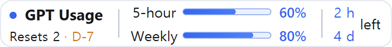
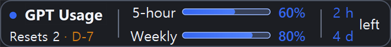
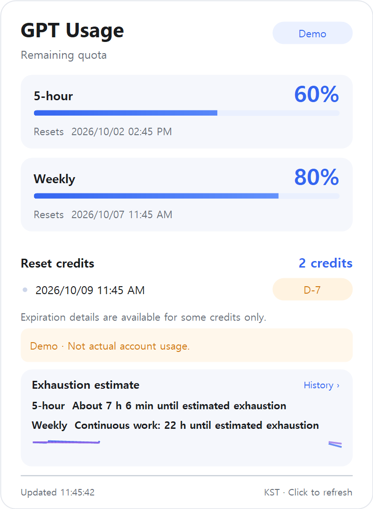
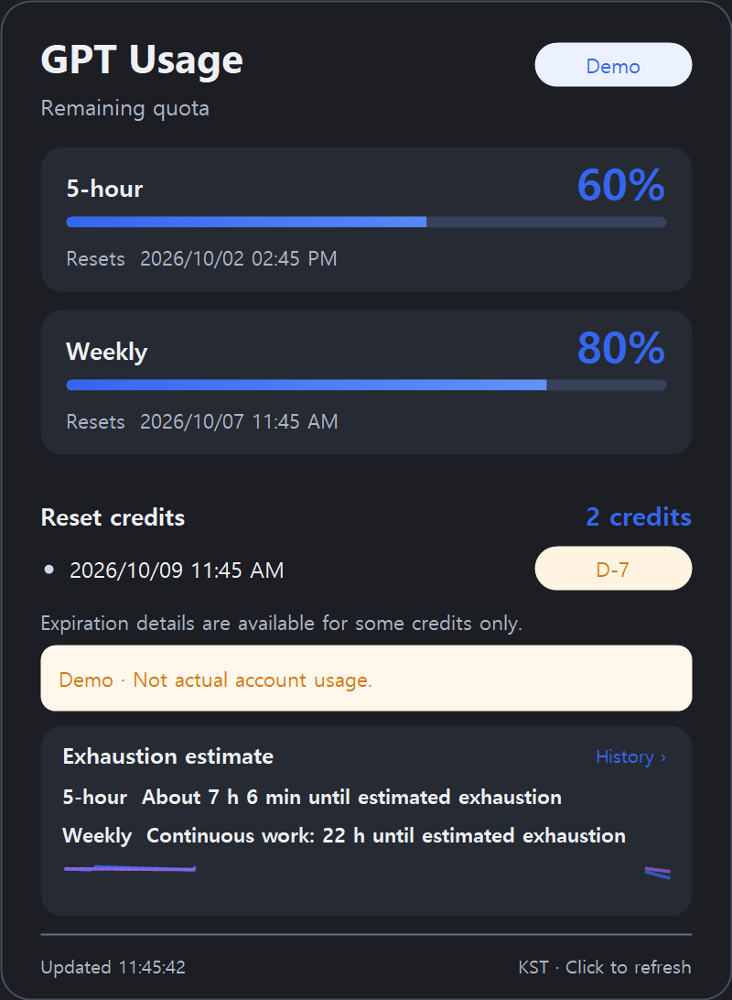
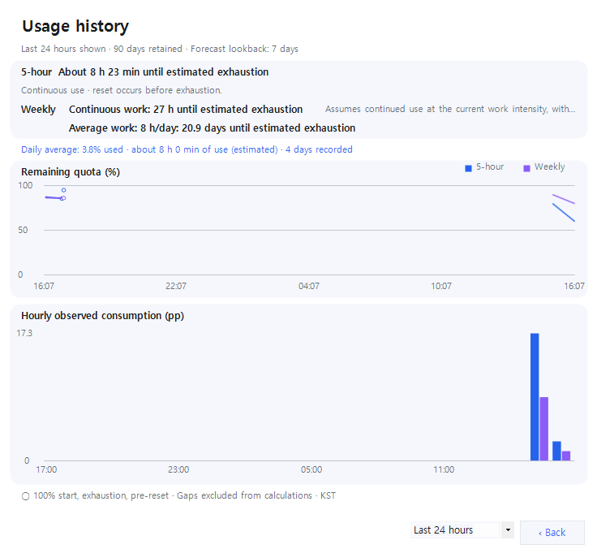
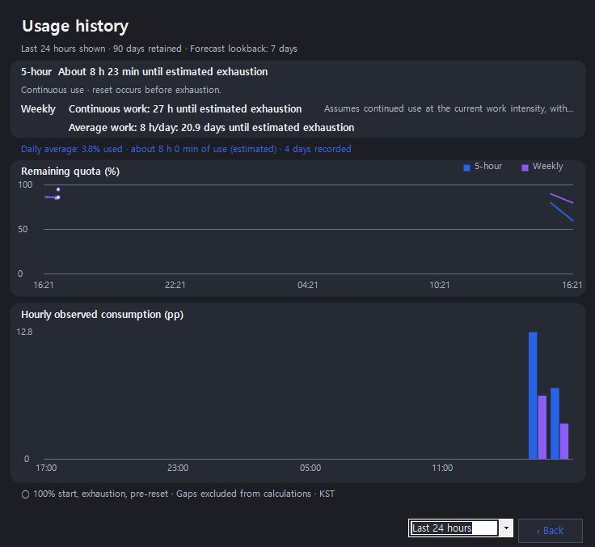
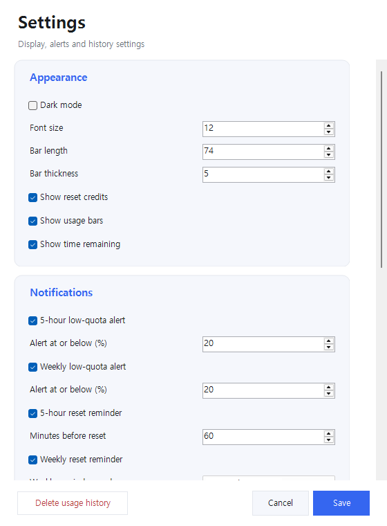

# GPT Usage Widget

한국어 안내는 [한국어 README](README.ko.md)를 확인하세요.

배포 ZIP에서 이 문서를 읽는 경우, 화면 이미지와 연결된 문서는 [온라인 README](https://github.com/eespark/gpt-usage-widget#readme)에서 확인하세요.

A local Windows taskbar widget that displays your remaining Codex 5-hour and weekly quota beside the clock. Supports light and dark themes, usage history, configurable reminders, and local exhaustion estimates.


## UI previews

These images use simulated data, not a real account. Both light and dark themes are available in either language edition.

| View | Light theme | Dark theme |
| --- | --- | --- |
| Taskbar widget |  |  |
| Usage details |  |  |
| Usage history |  |  |

Settings:



## Download and run

1. Install the Codex desktop app or CLI and sign in with your ChatGPT account.
2. Download a Windows x64 ZIP from [Releases](https://github.com/eespark/gpt-usage-widget/releases) and extract it.
3. Run `GPTUsageWidget.en.exe` for English or `GPTUsageWidget.exe` for Korean.

The English archive is `GPTUsageWidget-v1.0.2-win-x64-en.zip`; the Korean archive is `GPTUsageWidget-v1.0.2-win-x64.zip`. If no release has been published, build from source using the instructions below.

## Requirements and sign-in

- Windows x64 with .NET Framework 4.8. A separate .NET SDK is not required.
- Codex CLI must be available and signed in with your ChatGPT account. The widget can discover the CLI bundled with the Codex desktop app and reuse its existing sign-in.
- Browser-only ChatGPT sign-in does not sign you into Codex CLI. If discovery fails, set `CODEX_USAGE_CLI` to the full path to `codex.exe`.
- The widget has no separate login screen and does not install Codex CLI automatically. API-key accounts may not provide subscription quota information.

This unofficial widget shows Codex quota, not every ChatGPT model's separate chat limit. Authentication and credential refresh are handled by Codex CLI.

## Features

- Remaining percentages, blue progress bars, and reset countdowns for both quota windows.
- Reset credits and expiration dates when available, highlighted from D-7.
- Hover details and integrated usage history. Click the estimate card to open history; click outside to dismiss the panel.
- Click and release to refresh. Right-click for settings, positioning, startup, and exit. Choose **Show widget again** if the widget disappears.
- Configurable low-quota thresholds and reminders before each reset.
- Card-based settings with history deletion, Cancel, and Save in a fixed footer.
- Persistent local history with 30/90/180/365-day retention (default 90). Forecast lookback is separately selectable as 1/3/7/14 days (default 7).
- Light and dark themes, optional Windows startup, and polling adjusted for inactivity, connection failures, lock, and sleep.

Both editions use Korea Standard Time (UTC+9) for reset times, calendar-based reminders, and daily totals. Run one edition at a time because they share the same settings and history.

## Forecasts

**Continuous work:** remaining quota divided by consumption intensity estimated from positive-consumption 15-minute buckets. This assumes uninterrupted work at that intensity and does not use average daily work hours. Intensity updates when consumption is observed; short idle periods do not inflate available time.

**Weekly days:** remaining weekly quota divided by weighted average consumption on completed observed dates. This is independent of the continuous-work estimate. Average daily work hours are a separate summary estimated from coverage of positive-consumption buckets.

Continuous estimates require at least four completed buckets with three positive-consumption buckets, roughly one valid observed hour or more. Daily averages require completed dates with at least one hour of valid observations. One observed date may not represent typical use. Long polling gaps and reset jumps are excluded rather than treated as idle use.

These are conditional approximations, not exact exhaustion timestamps or task/token counts. The panel warns when reset precedes projected continuous exhaustion. Future reset quota is not added, and unobserved consumption may be omitted.

한국어로 된 계산 원리와 연구 근거는 [분석 기간과 예측](분석%20기간과%20예측.md)을 확인하세요.

## Local data and privacy

Settings, quota history, and alert state are stored in `%LOCALAPPDATA%\GPTUsageTaskbar\`. The existing folder name is retained for compatibility.

The widget does not read or store authentication files, passwords, API keys, or conversations. It requests quota information through the installed Codex CLI's app-server interface. Refreshing usage does not submit a model inference request. Codex CLI may contact OpenAI using its own authentication and network configuration.

## Windows integration

The widget is a separate borderless window over the taskbar. It does not inject code into Explorer or reserve taskbar button space. Adjust its position if it overlaps other buttons. It displays on the primary taskbar, follows size and DPI changes, and hides when the taskbar is hidden or a fullscreen application is active. Vertical and unusually small taskbars may have positioning limitations.

## Build and verify

Build from the repository directory using the Windows .NET Framework C# compiler. No external packages are installed.

```powershell
.\build.ps1
```

This creates `bin/GPTUsageWidget.exe` and runs automated checks. To build the English edition:

```powershell
.\build.ps1 -English
```

To build and test both editions and create release ZIPs with SHA-256 checksums:

```powershell
.\package.ps1
```

Release builds use separate directories under `artifacts` and do not overwrite the running widget. The script checks archive file lists, checksums, and contents against the current build and documentation. To verify existing packages:

```powershell
.\tools\CheckRelease.ps1
```

한국어 ZIP에는 실행 파일·간단 사용 가이드·예측 설명·MIT 라이선스를 포함합니다. 영어 ZIP에는 실행 파일·이 README·MIT 라이선스를 포함합니다. 개인 설정·기록·인증 정보·진단 파일·바로가기는 제외합니다.

GitHub Actions verifies both editions on `main` pushes, pull requests, version tags, and manual runs. Check [Actions](https://github.com/eespark/gpt-usage-widget/actions). Publish both ZIPs and their `.sha256` files through [Releases](https://github.com/eespark/gpt-usage-widget/releases).

`--render-demo` generates previews with simulated data. `--probe` and `--diagnose` write diagnostic files that must not be included in public distribution.

## References and license

The implementation uses C# and WinForms. The reference projects below use Rust; their project trees, dependencies, and source files are not included here. Common Codex protocols and Windows APIs can produce similarities. This is not a comprehensive code-similarity audit.

- [CodexPeek](https://github.com/lch5518/CodexPeek)
- [codex-usage-monitor](https://github.com/upstream-ray/codex-usage-monitor)
- [Microsoft extended window styles](https://learn.microsoft.com/en-us/windows/win32/winmsg/extended-window-styles)

Source code and the project's own icon are distributed under the [MIT license](LICENSE). See [the changelog](CHANGELOG.md). This project is not affiliated with OpenAI. Executables are unsigned; compatibility can vary with taskbar configuration and Codex installation.
